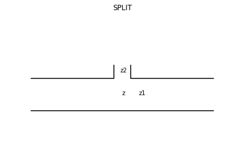

# Calcimpy Basics

2018.10.09 

Yoshinobu Ishizaki(ysnbiszk@gmail.com)

- [Calcimpy Basics](#calcimpy-basics)
    - [Goal](#goal)
    - [XMEN FORMAT](#xmen-format)
        - [Basics](#basics)
        - [Tube with varying diameter](#tube-with-varying-diameter)
        - [Grouping](#grouping)
        - [SPLIT PATH (TONEHOLE)](#split-path-tonehole)
        - [BRANCH and MERGE](#branch-and-merge)
    - [IMPEDANCE CALCULATION](#impedance-calculation)
        - [Webster equation](#webster-equation)
        - [Wall dumping effect](#wall-dumping-effect)

## Goal

Writing a program which calculate input-end acoustic impedance of given air column ( wind instrument's bore  ) 
by Julia.

Air column's shape ( so called MENSUR ) should be given by XMEN format that will be described below.

## XMEN FORMAT

XMEN format is defined here to express air column's shape (MENSUR).

It is a CSV text file with '.xmen' extension.

Any spaces and tabs are ignored.

Comment is inserted at any position starting with  '#' (same as Julia, Python).

Unit is in mm. All calculation is done under SI unit system.

Output is frequency(Hz), impedance(complex) as a Dataframe.


Julia's numeral and arithmetic notation such as '+-*/^, '1e-3' and assignment 'x = 10.2' can be used at any point while it does not conflict with pre-defined keywords.

### Basics

Most simple air column is a tapered tube with starting diameter df, ending diameter db and length r.

Df denotes Diameter Forward, db: Diameter Backward, R: relative length.

It can be expressed by a simple line.

```
df,db,r
```
It is a straight tube if df == db.

To express whether end is open or closed, ending line is needed.

For open end,

```
df,db,r
db,0,0,
```

and for closed end,

```
df,db,r,
0,0,0,
```

Pre-defined keywords `OPEN_END`, `CLOSED_END` can be used instead of writing `db,0,0,` or `0,0,0` directly.

```
df,db,r
OPEN_END
```

For more complex format, main trunc must be bracketed by `[]`.

```
[
    df,db,r
    db,0,0,
]
```

Or use keyword,

```
MAIN
df,db,r,
db,0,0,
END_MAIN
```

So, a simple tube mensur file can be written as,

```
# simple tube 
[
    10,10,1000,
    10,0,0,# open end
]
```

### Tube with varying diameter 

In case of a tube with varying diameter like a brass instrument's bell, if it is sliced into thin parts along with its axis, each thin part can be approximated by a tapered tube.
Black lines of next picture is such an example.


Each thin tapered tube has its own $df_i,db_i,r_i$ and a whole tube can be expressed by sequencial thin tubes.

```
df1,db1,r1
df2,db2,r2
df3,db3,r3
...
```
Most of the case, $df_i = db_{i-1}$.

### Grouping

It is easy to write and read a mensur file, if we can use grouping.
To ease of reading and writing a mensur file
 for human, `GROUP, END_GROUP` or symbol '{}' can be used to express grouping.

```
{,BELL
16.0,16.009980886991173,1.0
16.009980886991173,16.019980475710756,1.0
...
219.00691080366659,250.1561248607896,1.0
250.1561248607896,300.0,1.0
}
```

This group can be inserted using `INSERT` or `@` in XMEN.

```
[
INSERT, BELL
]

{,BELL
# bell definition here
}
```


### SPLIT PATH (TONEHOLE)

Sometimes there is a splitting side hole path to outside like a tonehole of woodwind instruments or a waterkey of brass instruments.

It is better to include their effect into calculation even when they are closed by a key cover, because short perpendicular path is connected to main path.



Provided z1,z2 as each trunc's acoustic impedance, z at connecting point is,

$$
\frac{1}{z} = \frac{1}{z_1} + \frac{1}{z_2}
$$

To express this SPLIT, keyword `SPLIT` or symbol `|` can be used in XMEN file.

```
SPLIT, name, ratio
```

Here, `name` is a group name of splitting path, `ratio` is value between [0,1].
0: actually does not connect splitting path.
1: whole effect of splitting path is included.

```
# sample split mensur
[
    10,10,150,
    |,TH1,1,
    10,10,850,
    OPEN_END
]

{,TH1
8,8,5,
OPEN_END
}
```

### BRANCH and MERGE 

In a brass instrument's valve, 2 paths are blended while it is moving.
Such state must be calculated to know half valve acoustic impedance.


For precise theoretical calculation at merging point (left side of picture above), see 
[loop_impedance.nb.pdf](loop_impedance.nb.pdf).

For this purpose, `BRANCH` and `MERGE` or `<` and `>` can be used in XMEN file.

```
BRANCH, name, ratio
... # main path
... # main path
MERGE, name, ratio
```
`name` is a group name of another path and `ratio` is connecting ratio [0,1].
0: does not connect to another path (main path only). 1: another path only. skip main path between BRANCH and MERGE. 
If `ratio` is between 0 and 1, two paths are blended. 

```
# branch test mensur
[
10,10,300,
<,SL1,0.5
10,10,200,
>,SL1,0.5,
10,10,500,
OPEN_END
]

{,SL1
12,12,100,
OPEN_END
}
``` 

## IMPEDANCE CALCULATION

### Webster equation

In an acoustic air column, webster equation is used to explain its sound field.

$$
\frac{d^2 q(x)}{dx^2} + \frac{1}{S(x)} \frac{dS(x)}{dx} \frac{d q(x)}{dx} + k^2 q(x) = 0  
$$

where q(x) is a velocity potential function, S(x) is a section area at x and k : wave number.

For simple taper (df,db,r),

$$
S(x) = \frac{\pi}{4} ( \frac{db (r-x) + df x}{r} ) ^2 ,  x \in [0,r]
$$

Substituting with this, the equation has a general solution,

$$
q(x) = \frac{A exp(i k x) + B exp(-i k x)}{db (r-x) + df x} 
$$

Let (pi,Ui) as pressure and volume velocity at input end (x=0), and (po, Uo) at output end (x=r).

Since $p = i \omega \rho q(x)$ and $U = -\frac{dq(x)}{dx} S(x)$, we can write transmission equation as, 

$$
\begin{pmatrix}
 pi \\
 Ui
 \end{pmatrix}
= T
\begin{pmatrix}
po \\
Uo
\end{pmatrix}
$$

where T is a transmission matrix in this part.

And using z $\equiv$ p/U, zi is calculated from zo.

See [Webster_equation.nb.pdf](Webster_equation.nb.pdf) for more precise expression.

### Wall dumping effect

To include wall dumping effect into acount,
wave number k is modified to have imaginary part.

$$
k = \sqrt{\frac{\omega}{c}(\frac{\omega}{c} - 2 (-1+i) A)}
$$
where,
$$
A = (1 + \frac{\gamma-1}{\sqrt{Pr}})\frac{\sqrt{2 \omega \nu}}{c D}
$$

$\gamma$ : specific heat constant, Pr : Prandtl number, $\nu$ : dynamic viscous constant, $\omega$ : wave frequency, D : average diameter, c : speed of sound.

Dumping effect is always calculated by calcimp.

